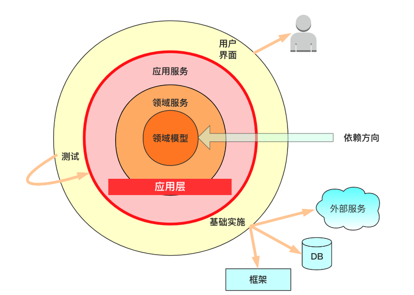

跨越DDD从理论到工程落地的鸿沟
======
> 张建飞（Frank），2022-03-03 17:42:36
>
> [原文](https://blog.csdn.net/significantfrank/article/details/123267395)
>
> 请认真细心阅读，实践一遍代码，才会有深刻思考和大收获。


**DDD作为一种优秀的设计思想，的确为*复杂业务治理*带来了曙光**。
然而，因为DDD本身难以掌握，很容易造成DDD从理论到工程落地之间出现巨大的鸿沟。
就像电影里面的桥段，只谈DDD理论姿势很优美，一旦工程落地就跪了......
所以，DDD的项目，工程落地很重要，**否则很容易变成“懂得了很多道理，却依然过不好这一生”**。


**这篇文章，我会从DDD的核心概念讲起，但重点会讲如何把理论落地成代码**，期望给那些正在探索DDD的同学一些指引和启发。


# 1. DDD的核心概念
DDD难以掌握的原因之一是因为其涉及很多概念，比如像Ubiquitous Language、Bounded Context、Context Mapping、
Domain、Domain Service、Repository、Aggregation Root、Entity、Value Object等等。
这里简要介绍一下DDD的核心概念，了解这些概念可以更好地帮助我们落地DDD。


## 1.1 统一语言
Eric Evans在解释**DDD本质**的时候，重点提到“Exploration and reshaping the ubiquitous languages"，也就是**探索并重塑统一语言**。
统一语言是DDD中非常重要的概念，因为语言是我们认知的基础，语言都不统一，就像一个人说阿拉伯语，一个人说汉语，那怎么能交流的起来呢？

**对于统一语言，我建议每个项目都要有一份自己的核心领域词汇表**。
这个词汇表至少要包含中文、英文、缩写、解释四列，中文是我们日常交流和文档中经常要体现的，所以需要统一，这样我们在交流的时候才能高效，没有歧义；
英文和英文缩写主要体现在我们的设计和代码上，也就是说**我们的“统一语言”不仅仅是停留在交流和文档中，还要和代码保持一致，这样才能做到知行合一，提升代码的可读性和系统的可理解性**。

比如一个CRM系统，我们可以从业务需求中挖掘出一些重要的领域概念，把这些概念整理成词汇表会如下所示。

| 中文   | 英文               | 缩写 | 解释            |
|------|------------------|----|---------------|
| 客户   | Customer         |    | 营销对象          |
| 机会   | Opportunity      |    | 可能成交的机会       |
| 线索   | Leads            |    | 潜在的客户         |
| 联系人  | Contact Person   |    | 能联系到客户的关键人    |
| 公海   | Public Sea       |    | 所有客户经理共享的客户资源 |
| 私海   | Private Sea      |    | 客户经理独占的客户资源 |
| 客户经理 | Customer Manager | CM | 销售人员 |

有了这个核心领域词汇表，以后团队的交流、文档、设计和代码都应该以这个词汇表为准。
这里需要注意的是，词汇表中英文对中文的翻译不一定非常“准确”，不过没关系，
**语言就是一个符号，共识即正确，只要大家容易理解达成一致即可**。
就像上面词汇表中私海这个概念的翻译是Private Sea，这是一个典型的Chinglish，正统的翻译是Territory，
但是大家都认为Private Sea更容易理解，只要达成共识，用这个名称也挺好。


## 1.2 限界上下文
大型软件系统的单体结构很难应付日益膨胀的复杂度。和解决所有复杂问题一样，除了分而治之，各个击破，别无他法。
事实证明，对于微服务的边界划分使用DDD的战略设计是一个有效手段。AWS全球云架构战略副总裁Adrian Cock Croft就曾说过：
Microservices is a loosely-coupled, service-oriented architecture with bounded context.（微服务就是在限界上下文下的松耦合的SOA。）


如上图所示，通过服务划分，我们可以聚焦在一个大系统下的一个Bounded Context里面，从而把原来大而复杂的问题空间，划分成多个小的、可以理解的小问题域。

如何把一个大的模型分解成小的部分没有什么具体的公式。**如果非要给服务划分一个评判标准的话，那么这个评判标准应该是高内聚低耦合**。

**高内聚**体现在要尽量把那些相关联的以及能形成一个自然概念的因素放在一个模型里。
如果我们发现两个服务之间的交互过于紧密，比如有非常频繁的API调用或者数据同步，那么这两个域可能都不够内聚，放在一起可能会更好。

**低耦合**是和内聚性相对应的，如果领域不够内聚，他们之间的耦合自然就高了，如果两个服务，界限不清晰，领域高度重合，就会造成严重的耦合问题。

**系统耦合是一方面，人员耦合是另外一个考量因素**。
总体上来说，我不提倡微服务（Bounded Context）划分太细，因为服务太多，会加重运维成本。
但服务也不能太粗，试想一下，如果一个服务需要8个人去维护，在上面做开发。那么解决代码冲突，环境冲突，发布等待都将是一个问题。
**通常一个服务，只需要一到两个人维护是相对比较合理的粒度**。

除了服务的粒度之外，关于领域的类型我们也有必要去了解一下，领域的类型划分旨在帮助我们理解领域的主次之分，从而知道什么是我当前Bounded Context的核心。
在DDD中，领域被分成三种类型。
1. **核心域（Core Domain）**，顾名思义这是我领域的核心。有一点需要注意，Core的概念是随着你视角的变化而变化的。
   对于本领域来说是Core，对于另外一个领域而言可能只是Support。
2. **支撑子域（Supporting Subdomain）**，虽然不是当前问题的核心领域，但也是必不可少的。
   比如，授信子服务离不开客户信息，所以客户服务是授信服务的支撑子域。
3. **通用子域（Generic Subdomain）**，如果一个子域被用于整个业务系统，那么这个子域便是通用子域。
   通常，像账号、角色、权限都是常见的通用子域，每个系统都需要。


## 1.3 上下文映射
通过上面的战略设计，一个大型业务系统，会被划分成多个各自独立的Bounded Context，也就是多个微服务，这些服务需要互相协作，来完成完整的业务功能。

每一个限界上下文都有一套自己的“语言”，如果在该领域要使用其它领域的信息，我们就需要一个“翻译器”，把外域信息翻译成本领域的概念。
**这个在不同领域之间进行概念转化、信息传递的动作就叫上下文映射（Context Mapping）**。
上下文映射主要有两种解决方案：共享内核和防腐层。

所谓的**共享内核（Shared Kernel）**，是指把两个子域中共同的实体概念抽取出来，形成一个组件（java中的jar包），然后通过内联（inline）的方式，分别被不同的子域使用。


共享内核的最大好处是代码复用和能力共享，然而坏处也很明显，**即高耦合：任何对于“共享内核”的改动都要小心翼翼的协调两个领域的技术团队，且会影响两个领域**。
说实话，这个副作用有点伤不起，所以**在实践中，更推荐的上下文映射方法是防腐层**。

所谓的**防腐层（Anti-Corruption，AC）**，是指**在一个领域中，如果需要使用其它领域的信息，可以通过AC进行防腐和转义**。
实际上，在微服务的环境下，服务调用是一个普遍的诉求，因为没有一个服务是孤立的，都需要借助其它服务提供的数据，共同完成业务活动。

就像中国傍边需要有个朝鲜，俄罗斯旁边需要一个中立的乌克兰一样，我们不能让外领域的东西随便“入侵”渗透到本领域。
**为了保证本领域的完整性和独立性，我们需要做一层隔离和防腐**，否则唇亡齿寒，国将不国。


AC的做法有一定的代价，因为你要做一次信息转换，把外域的信息转成本域的领域概念。其好处是双方都拥有了更大的自主权和灵活度。
**系统架构就是这样，我们永远要在重复（Duplication）耦合低和复用（Reuse）耦合高之间取一个折中，进行权衡**。


## 1.4 领域模型
**领域模型将现实世界抽象为了信息世界，把现实世界中的客观对象，抽象为某一种信息结构，而这种信息结构并不依赖于具体的计算机系统**。
**它不是对软件设计的描述，它是和技术无关的（Technology-Free）**。

例如，电商的核心领域模型就是商品、会员、订单、营销等实体，和你使用什么技术实现是没有关系的，你用Java可以实现，用PHP，GO也能实现。
但不管是哪种技术实现方式，都不应该影响我们对领域模型的抽象和理解。

正因为领域模型的技术无关性，并且领域模型是我们的核心，这才有了洋葱圈架构，即领域模型处在架构的最内核，并且不依赖任何外围的技术细节。



这里顺便回答一下同学经常问的事务（Transaction）在哪里实现的问题，为了保持领域的技术无关性，事务最好被管理在App的Service中。

**关于如何设计领域模型，简单来说，就是分析语言**。
这也是为什么我们一直在强调统一语言的重要性，因为只有真正的理解了业务，把重要的领域概念阐述清楚，才有可能设计出比较好的领域模型。

具体的建立领域模型的步骤，可以分为以下三步：
1. **理解问题：我们需要用简短的语句把问题域描述清楚**，用户故事或者用例，是建模的关键前序动作。
   除了用户故事外，我们当然也可以使用事件风暴（Event Storming），四色建模法等手段，**只是我觉得用户故事比较简单易行，所以推荐用这种方式**。
2. **挖掘概念（Digging out concepts）**：领域概念隐含在语句中，**重点关注语句中的名词（nouns）**，因为nouns常常以为这是重要的领域概念。
   这一步不容易做到，因为自然语言有很大的随意性，很多同义词、多义词混淆其中。而且，有些关键概念也不一定就是名词，也可能通过动词（verbs）进行伪装。
3. **建立关联**：寻找关系，**需要关注动词（verbs）**。因为关联意味着两个模型之间存在语义联系，在用例中的表现通常为两个名词被动词连接起来。


# 2. 工程落地
Talk is cheap，show me the code。一切的一切，最终还是要落到代码上，而这一步也是造成问题最多的地方。

DDD本身是一个非常优秀的设计思想，关于这一点应该争议不大。**很多同学的困惑不在于DDD的思想，而在于不知道如何把DDD落到代码上**。

“我的业务只是CRUD，为什么还要Domain呢？”

“既然Domain是承载业务逻辑的地方，那我把业务逻辑都放进Domain可以吗？”


## 2.1 都是CRUD为什么要Domain？
任何的应用都是由一系列功能（functionality）和数据（data）组成。
如果只有function没有data，那么它只是一个函数。相反，如果只有CRUD对数据的操作，那么，它只是一个数据库（database）。

可以说，一点业务逻辑的应用基本上是不存在的，**Domain层的价值就在于，它为我们提供了一种内聚业务逻辑、显性化表达业务语义的地方**。

以**客户注册**这个场景为例，如果注册没有什么业务逻辑，只是往数据库中插入一条记录，那么有没有Domain都无所谓。
然而，真实的业务当然不允许我们这样做，业务专家们会提出很多**业务规则**，来防止那些不够资格的人注册成功。

而且业务需求还在不断变化，有一些业务规则还被用在不同的地方，
比如业务那边发起了一个新的规则：从3月份起，注册资本在1000万以上的公司是大客户，会有特殊的优惠政策。
显然，**大客户是一个比较重要的领域知识**，而且可以预判这个概念不仅在注册的时候，在其它地方也可能被用到。

现在你有两种选择，一种是如下所示，直接把这个业务规则追加到原来的业务逻辑上。
```
if (registeredCapital >= 1000W) {
    // do something
}
```

另一种是，**我们把这个重要的业务概念，内聚到领域实体身上，显性化的表达出来**。
```
// 领域能力沉淀
Customer {
    private long registeredCapital;

    // 判断是否大客户
    public boolean isBigClient() {
        return registeredCapital >= 1000W;
    }
}

// 使用
if (customer.isBigClient()) {
       // do something
}
```

很明显，第二种领域封装的方式会更好，它至少有两个好处。
其一，**业务语义得到显性化的表达，大客户（bigClient）的概念就直接呈现在代码中**。
其二，**能更好的应对变化**，比如有一天我们对大客户的定义发生变化，除了注册资本之外，还要看员工数，那么只需要修改isBigClient()，
而第一种做法要散弹式修改所有需要关注大客户概念的地方。

类似于“大客户”这样的领域知识（Domain Knowledge），就非常适合Domain层来承载。
因为Domain里面有我们最重要的**领域概念、领域实体**，再加上**领域能力**（也就是那些**业务规则**），从而形成所谓的 Knowledge Rich Design (知识丰富的设计）。
从这个意义上来说，领域模型只是我们领域知识的一部分，**业务活动和规则如同所涉及的实体一样，都是领域的核心**。

除此之外，在当前服务化、分布式大行其道的今天，我们的数据也不一定就是存在本地的数据库，很可能这个数据是来自于另一个服务。
这种情况下，**Domain层给我们提供了一个在当前限界上下文（Bounded Context）里，对外域进行防腐、隔离的机会**。


## 2.2 Domain层是必选的吗？
“按你这么说，我一定需要这个Domain层咯？可是Domain层的实体模型和数据模型的转换，成本有点高啊！”

有此顾虑的同学不在少数，的确，Domain层作为原来三层架构之外新引入的层次，会带来一些额外的成本。
关于这个问题，**与其把Domain层当成负担，不如把它当成是一个机会或者投资**，既然是投资，我们就要看ROI（投入产出比）。

**扪心自问，我当前对Domain的投资——抽象、领域建模、领域能力沉淀等，是否提升了我代码的可读性、可理解性，
或者从长期来看提升了系统的可维护性，如果ROI成正比，就值得去做**。

有没有ROI不成正比的时候呢？有的，比如简单的Query，可能就是**读取数据，没有什么业务逻辑**，
那么我们也完全可以绕过Domain层，让数据模型直接转换成DTO，减少一层数据转换，这也是CQRS（Command Query Responsibility Segregation）所提倡的。

作为一个“没有银弹”的信徒，我很认同佛瑞德·布鲁克斯的观点。**虽然Domain非常有用，但也不是“银弹”**。
所以，如下图所示，在设计DDD的应用架构时，比如我开源的COLA架构。
**我更愿意把Domain层设计成开放的**，这种开放性不仅体现在CQRS的时候，App可以绕过Domain层直达Infrastructure；
也体现在当你的团队实在hold不住DDD的时候，可以选择退化到老的三层架构。


虽然可以退化，但不应该成为你轻易放弃Domain层的理由。据我观察，很多同学不喜欢DDD，其根本原因还不在于对象之间的转换成本（实际上，这个转换成本也没那么大），
而在于他不清楚Domain的职责，不知道哪些东西应该放到Domain里面。
**一种典型的错误做法是把所有的业务逻辑都放到了Domain层，包括我们上面说的CRUD统统放到了领域层，这样的DDD当然没人喜欢**。


## 2.3 把业务逻辑都写进Domain？
每当我看到同学把**所有业务逻辑**都写进Domain层，我就会问他，
“你这样把App层的所有业务逻辑都搬到Domain层，能得到什么益处呢？和把这些代码直接放在App层的区别在哪里呢？
况且，放在App层，因为少了一个层次，代码会更加简单，为什么要劳心劳力地再加一个Domain层呢？”

“那要怎么办呢？”同学一边点头一边疑惑地问。

**我给的方案是“先把App做厚，再把App做薄”**。什么意思？就是我们先可以**把业务逻辑都写到App里面**，在写的过程中，我们会发现有一些**业务逻辑**，
**不仅仅是过程式的代码，它也是领域知识（Domain knowledge），应该被更加清晰、更加内聚的表达出来，那么我们就可以把这段代码沉淀为领域能力**。

举一个例子，还是以**用户注册**为例，一开始，正如我们一直这样做的，直接在App层写出如下的过程代码：
```
public class CustomerServiceImpl {

    private CustomerGateway customerGateway;

    private HealthCodeService healthCodeService;

    public void register(CustomerDTO customerDTO) {
        Customer customer = Customer.fromDTO(customerDTO);

        // 1. 校验年龄
        if (customer.getAge() < 18) {
            BizException.of("对不起，你未满18岁");
        }

        // 2. 校验国籍
        if (!customer.getCountry().equals("china")) {
            BizException.of("对不起，你不是中国人");
        }

        // 3. 查看健康码，需要调用另外一个服务
        HealthCodeRequest request = new HealthCodeRequest();
        request.idCardNo = customer.getIdCardNo();
        HealthCodeResponse response = healthCodeService.check(request);
        if (!response.isSuccess()) {
            BizException.of("无法验证健康码，请稍后再试");
        }
        if (!response.isGreen()) {
            BizException.of("对不起，你不是绿码");
        }

        // 4. 注册用户
        customerGateway.save(customer);
    }
}
```

写好后，我们再回过头来审视一下，看看**哪些东西可以沉淀为领域能力**，然后优化我们的代码。

我们先看**年龄和国籍校验**，年龄和国籍都是customer的属性，那么谁对它们最熟悉呢？当然是customer自身了，
**对于这样的业务知识，无论是从可理解性的角度，还是从功能内聚和复用性的角度，把它们沉淀到customer身上都会更合适**。
于是，我们可以**在customer实体上沉淀这些业务知识**：
```
    public void isRequiredAge() {
        if (age < 18) {
            BizException.of("对不起，你未满18岁");
        }
    }

    public void isValidCountry() {
        if (!country.equals("china")) {
            BizException.of("对不起，你不是中国人");
        }
    }
```

**健康码**有点特殊，虽然它也是**Customer的健康码**，但是它并不存在于本应用中，而是存在于另一个服务中，需要通过远程调用的方式来获取。
这在我们的分布式系统中，是非常常见的现象，**即我们要通过分布式的服务交互来共同完成业务功能**。

如果直接调用外部系统，基于外系统的DTO，当然也能完成代码功能，但这样做会有三个问题：
1. **表达晦涩**，我只是要检查一下健康码，却有一堆的代码。（这只是示意，真实的远程调用肯定要比这个代码多）
2. **复用性差**，校验健康码不仅仅客户注册会用到，可能很多客户相关的操作都会用到，难道都要这么写一遍？
3. **没有防腐和隔离**，HealthCodeResponse不是我这个领域的东西，怎么能让它如此轻易的侵入到我的业务代码中呢？

解决上面的问题，**我们就可以充分发挥Domain层的边界上下文（Bounded Context）的作用，使用上下文映射（Context Mapping），把外领域的信息映射到本领域**。
即我可以认为**HealthCode就是属于Customer的**，至于这个HealthCode是怎么来的，那是Gateway和infrastructure要帮我处理的问题，
它可能来自于自身的数据库，也可能来自于RPC的远程调用，总之那是infrastructure要处理的“技术细节”问题，对于上层的业务代码不需要关心。

按照这样的思路，我们可以**新建一个HealthCodeGateway来解开对健康码系统的耦合**。
```
/**
 * 对外系统的依赖通过gateway进行解耦
 */
public interface HealthCodeGateway {
    String getHealthCode(String idCardNo);
}
```

于此同时，**把如何获取HealthCode这样的技术细节问题丢给infrastructure去处理**。
```
/**
 * 在infrastructure中，完成如何获取healthCode的细节问题
 */
public class HealthCodeGatewayImpl implements HealthCodeGateway {
    private HealthCodeService healthCodeService;
 
    @Override
    public String getHealthCode(String idCardNo) {
        HealthCodeRequest request = new HealthCodeRequest();
        request.idCardNo = idCardNo;
        HealthCodeResponse response = healthCodeService.check(request);
        if (!response.isSuccess()) {
            BizException.of("无法验证健康码，请稍后再试");
        }
        return response.getHealthCode();
    }
}
```

最后，我们把从gateway获取到的healthCode赋值给customer，
对于customer来说，这个healthCode是远程调用拿到的，还是从数据库拿到的，它并不需要关心。

```
public class Customer {

    ...
    // 你虽然是游荡在外面游子，但我带你如同己出
    private String healthCode;

    public void isHealthCodeGreen() {
        if (healthCode == null) {
            healthCode = healthCodeGateway.getHealthCode(idCardNo);
        }
        if (!healthCode.equals("green")) {
            BizException.of("对不起，你不是绿码");
        }
    }

    ...
}
```

经过一系列的“**能力下沉**”之后，我们原来的**客户注册逻辑**，丑小鸭变白天鹅，成了下面这样的clean code。

```
public class CustomerServiceImpl {

    private CustomerGateway customerGateway;

    public void register(CustomerDTO customerDTO) {
        Customer customer = Customer.fromDTO(customerDTO);

        // 1. 校验年龄
        customer.isRequiredAge();

        // 2. 校验国籍
        customer.isValidCountry();

        // 3. 查看健康码，需要调用另外一个服务
        customer.isHealthCodeGreen();

        // 4. 注册用户
        customerGateway.save(customer);
    }
}
```

除了代码变得clean之外，代码的可理解性也提高了，因为原来那些过程式平铺的代码，被合理的**内聚到领域实体**身上之后，其代码的表达能力获得了提升。
阅读这种代码的体验应该和阅读语句通顺的短文无异，差不多是这样的感觉：
“if customer is required age, customer is in valid country, customer's health code is green, then save this customer to be registered”

所以，我们在落地DDD的时候，千万要小心，不要落入概念的教条，**而是要始终盯着我们的北极星目标——即系统的可理解性、可维护性，以及代码的可读性**。
如果你的DDD不仅没有到达这些目标，反而让系统变得更复杂，更难理解，给开发者带来额外的负担。那么就应该停下来，反思一下，我是不是走偏了。


# 3. 上下结合跨越鸿沟
> 自上而下的结构化分解(结构化思维)，自下而上的抽象建模(抽象思维)，循环迭代沉淀领域能力。

本文通过代码案例的方式，尝试解答一下大家在落地DDD过程中，常见的困惑问题。
希望给到大家**一个相对正确的落地DDD工程的开发范式**，总结一下，这个范式大概可以分为以下七个步骤：
1. **梳理业务**：梳理**业务流程**，挖掘**领域概念**，形成**统一语言**。
2. **战略设计**：划分**领域边界**，建立**限界上下文**。
3. **战术设计**：寻找**实体**，建立**关系**，形成**领域模型**。
4. **API设计**：根据**用户故事**，输出**服务功能API**。
5. **做厚App**：根据API功能要求，在App层编写**业务过程代码**。
6. **做薄App**：以**领域模型**为基础，优化**过程代码**，沉淀**领域能力和领域知识**，让**业务语义**显性化，做到Knowledge Rich Design (知识丰富的设计）。
7. **技术细节**：完善技术细节代码，比如API的暴露方式（RPC 或者 Restful），数据的存储方式（关系数据库 或者 NoSQL），ORM框架的选用（MyBatis 或者 JPA)等等。

最后，我想再次强调，**好的Domain层，不仅仅需要设计，更是在开发过程中，循环迭代沉淀出来的**。
用一句话来形容这个过程就是：**自上而下的结构化分解，自下而上的抽象建模，循环迭代沉淀领域能力**。


App应用层和Domain领域层是关键核心

------
关于如何提升抽象思维能力和结构化思维能力，请关注我的新书《程序员的底层思维》。

