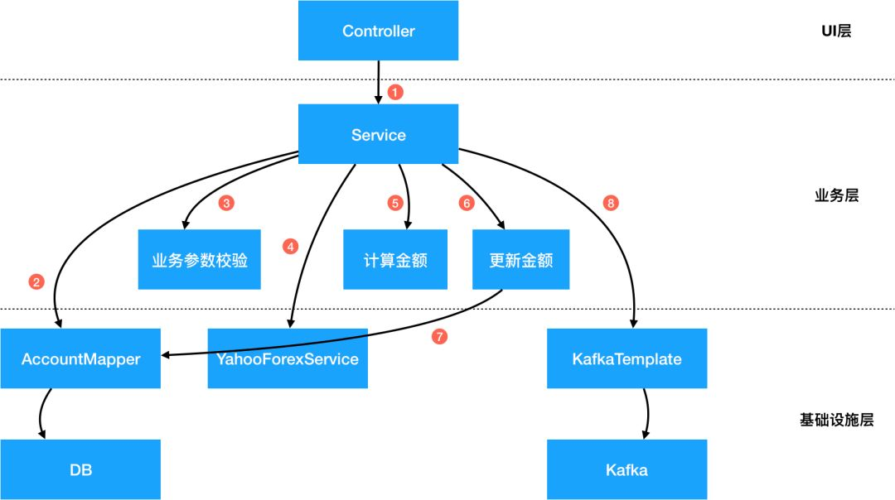
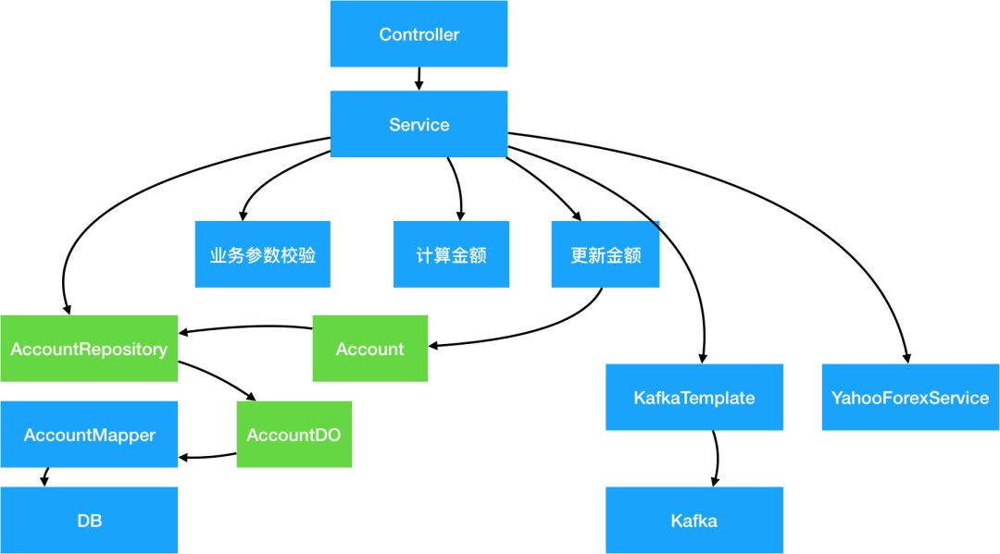
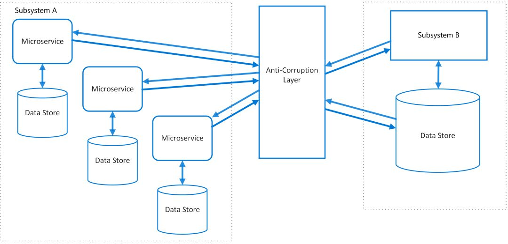
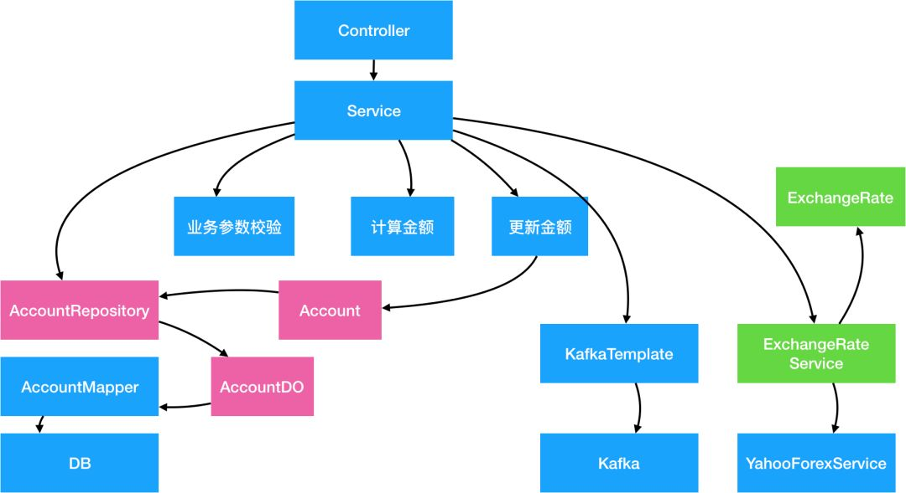
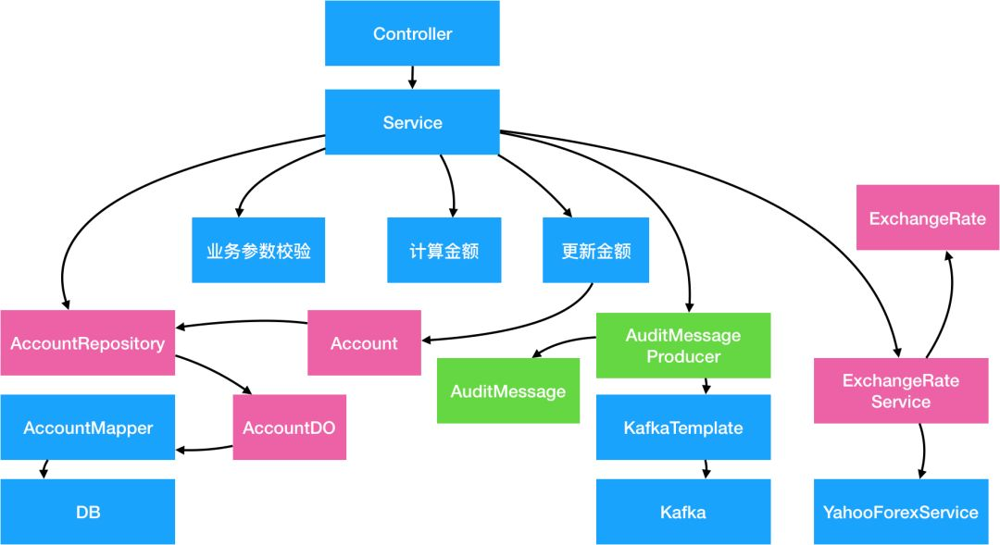
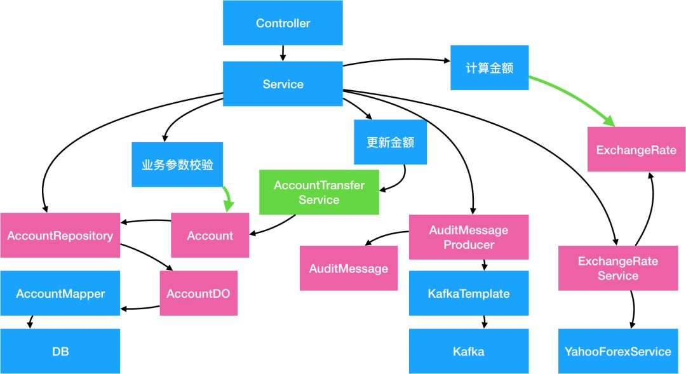
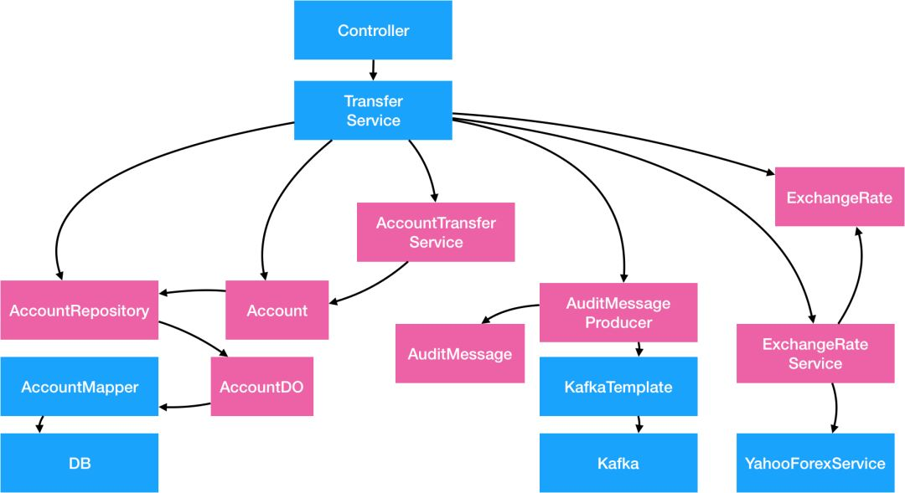
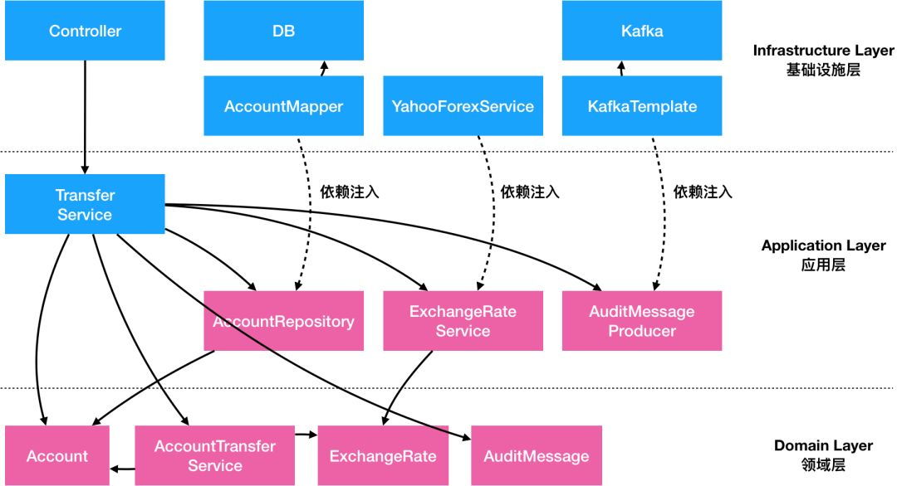

详解DDD系列 第二弹 - 应用架构
======
> 殷浩，大淘宝技术，2019-09-24 17:01
>
> [原文](https://mp.weixin.qq.com/s/MU1rqpQ1aA1p7OtXqVVwxQ)
>
> 请认真细心阅读，实践一遍代码，才会有深刻思考和大收获。


**架构**这个词源于英文里的“Architecture“，源头是土木工程里的“建筑”和“结构”，
而架构里的”架“同时又包含了”架子“（scaffolding）的含义，意指能快速搭建起来的固定结构。
而今天的应用架构，意指软件系统中固定不变的代码结构、设计模式、规范和组件间的通信方式。
在应用开发中架构之所以是最重要的第一步，因为一个好的架构能让系统安全、稳定、快速迭代。
在一个团队内通过规定一个固定的架构设计，可以让团队内能力参差不齐的同学们都能有一个统一的开发规范，降低沟通成本，提升效率和代码质量。

在做架构设计时，一个好的架构应该需要实现以下几个目标：
* **独立于框架**：架构不应该依赖某个外部的库或框架，不应该被框架的结构所束缚。
* **独立于UI**：前台展示的样式可能会随时发生变化（今天可能是网页、明天可能变成console、后天是独立app），但是底层架构不应该随之而变化。
* **独立于底层数据源**：无论今天你用MySQL、Oracle还是MongoDB、CouchDB，甚至使用文件系统，软件架构不应该因为不同的底层数据储存方式而产生巨大改变。
* **独立于外部依赖**：无论外部依赖如何变更、升级，业务的核心逻辑不应该随之而大幅变化。
* **可测试**：无论外部依赖了什么数据库、硬件、UI或者服务，业务的逻辑应该都能够快速被验证正确性。

这就好像是建筑中的楼宇，一个好的楼宇，无论内部承载了什么人、有什么样的活动、还是外部有什么风雨，一栋楼都应该屹立不倒，而且可以确保它不会倒。
但是今天我们在做业务研发时，更多的会去关注一些宏观的架构，比如SOA架构、微服务架构，而忽略了**应用内部的架构设计**，很容易导致代码逻辑混乱，很难维护，容易产生bug而且很难发现。
今天，我希望能够通过**案例的分析和重构**，来推演出**一套高质量的DDD架构**。


# 1 案例分析
我们先看一个简单的案例需求如下：
用户可以通过银行网页转账给另一个账号，支持跨币种转账。
同时因为监管和对账需求，需要记录本次转账活动。

拿到这个需求之后，一个开发可能会经历一些技术选型，最终可能拆解需求如下：
1、从MySql数据库中找到转出和转入的账户，选择用 MyBatis 的 mapper 实现 DAO；
2、从 Yahoo（或其他渠道）提供的汇率服务获取转账的汇率信息（底层是 http 开放接口）；
3、计算需要转出的金额，确保账户有足够余额，并且没超出每日转账上限；
4、实现转入和转出操作，扣除手续费，保存数据库；
5、发送 Kafka 审计消息，以便审计和对账用；

而一个简单的代码实现如下：
```java
public class TransferController {

    private TransferService transferService;

    public Result<Boolean> transfer(String targetAccountNumber, BigDecimal amount, HttpSession session) {
        Long userId = (Long) session.getAttribute("userId");
        return transferService.transfer(userId, targetAccountNumber, amount, "CNY");
    }
}
```
```java
public class TransferServiceImpl implements TransferService {

    private static final String TOPIC_AUDIT_LOG = "TOPIC_AUDIT_LOG";
    private AccountMapper accountDAO;
    private KafkaTemplate<String, String> kafkaTemplate;
    private YahooForexService yahooForex;

    @Override
    public Result<Boolean> transfer(Long sourceUserId, String targetAccountNumber, BigDecimal targetAmount, String targetCurrency) {
        // 1. 从数据库读取数据，忽略所有校验逻辑如账号是否存在等
        AccountDO sourceAccountDO = accountDAO.selectByUserId(sourceUserId);
        AccountDO targetAccountDO = accountDAO.selectByAccountNumber(targetAccountNumber);

        // 2. 业务参数校验
        if (!targetAccountDO.getCurrency().equals(targetCurrency)) {
            throw new InvalidCurrencyException();
        }

        // 3. 获取外部数据，并且包含一定的业务逻辑
        // exchange rate = 1 source currency = X target currency
        BigDecimal exchangeRate = BigDecimal.ONE;
        if (sourceAccountDO.getCurrency().equals(targetCurrency)) {
            exchangeRate = yahooForex.getExchangeRate(sourceAccountDO.getCurrency(), targetCurrency);
        }
        BigDecimal sourceAmount = targetAmount.divide(exchangeRate, RoundingMode.DOWN);

        // 4. 业务参数校验
        if (sourceAccountDO.getAvailable().compareTo(sourceAmount) < 0) {
            throw new InsufficientFundsException();
        }

        if (sourceAccountDO.getDailyLimit().compareTo(sourceAmount) < 0) {
            throw new DailyLimitExceededException();
        }

        // 5. 计算新值，并且更新字段
        BigDecimal newSource = sourceAccountDO.getAvailable().subtract(sourceAmount);
        BigDecimal newTarget = targetAccountDO.getAvailable().add(targetAmount);
        sourceAccountDO.setAvailable(newSource);
        targetAccountDO.setAvailable(newTarget);

        // 6. 更新到数据库
        accountDAO.update(sourceAccountDO);
        accountDAO.update(targetAccountDO);

        // 7. 发送审计消息
        String message = sourceUserId + "," + targetAccountNumber + "," + targetAmount + "," + targetCurrency;
        kafkaTemplate.send(TOPIC_AUDIT_LOG, message);

        return Result.success(true);
    }

}
```

我们可以看到，一段业务代码里经常包含了参数校验、数据读取存储、业务计算、调用外部服务、发送消息等多种逻辑。
在这个案例里虽然是写在了同一个方法里，在真实代码中经常会被拆分成多个子方法，但实际效果是一样的，而在我们日常的工作中，绝大部分代码都或多或少的接近于此类结构。
在Martin Fowler的 P of EAA书中，这种很常见的代码样式被叫做Transaction Script（事务脚本）。
虽然这种类似于脚本的写法在功能上没有什么问题，但是长久来看，他有以下几个很大的问题：**可维护性差、可扩展性差、可测试性差**。


## 问题1-可维护性差
一个应用最大的成本一般都不是来自于开发阶段，而是应用整个生命周期的总维护成本，所以代码的可维护性代表了最终成本。

**可维护性 = 当依赖变化时，有多少代码需要随之改变**

参考以上的案例代码，事务脚本类的代码很难维护因为以下几点：
* **数据结构的不稳定性**：AccountDO类是一个纯数据结构，映射了数据库中的一个表。
  这里的问题是数据库的表结构和设计是应用的外部依赖，长远来看都有可能会改变，比如数据库要做Sharding，或者换一个表设计，或者改变字段名。
* **依赖库的升级**：AccountMapper依赖MyBatis的实现，如果MyBatis未来升级版本，可能会造成用法的不同（可以参考iBatis升级到基于注解的MyBatis的迁移成本）。
  同样的，如果未来换一个ORM体系，迁移成本也是巨大的。
* **第三方服务依赖的不确定性**：第三方服务，比如Yahoo的汇率服务未来很有可能会有变化：轻则API签名变化，重则服务不可用需要寻找其他可替代的服务。
  在这些情况下改造和迁移成本都是巨大的。同时，外部依赖的兜底、限流、熔断等方案都需要随之改变。
* **第三方服务API的接口变化**：YahooForexService.getExchangeRate返回的结果是小数点还是百分比？
  入参是（source, target）还是（target, source）？谁能保证未来接口不会改变？如果改变了，核心的金额计算逻辑必须跟着改，否则会造成资损。
* **中间件更换**：今天我们用Kafka发消息，明天如果要上阿里云用RocketMQ该怎么办？后天如果消息的序列化方式从String改为Binary该怎么办？如果需要消息分片该怎么改？

我们发现案例里的代码对于任何外部依赖的改变都会有比较大的影响。
如果你的应用里有大量的此类代码，你每一天的时间基本上会被各种库升级、依赖服务升级、中间件升级、jar包冲突占满，
最终这个应用变成了一个不敢升级、不敢部署、不敢写新功能、并且随时会爆发的炸弹，终有一天会给你带来惊喜。


## 问题2-可拓展性差
事务脚本式代码的第二大缺陷是：虽然写单个用例的代码非常高效简单，但是当用例多起来时，其扩展性会变得越来越差。

**可扩展性 = 做新需求或改逻辑时，需要新增/修改多少代码**

参考以上的代码，如果今天需要增加一个**跨行转账**的能力，你会发现基本上需要重新开发，基本上没有任何的可复用性：
* **数据来源被固定、数据格式不兼容**：原有的AccountDO是从本地获取的，而跨行转账的数据可能需要从一个第三方服务获取，
  而服务之间数据格式不太可能是兼容的，导致从数据校验、数据读写、到异常处理、金额计算等逻辑都要重写。
* **业务逻辑无法复用**：数据格式不兼容的问题会导致核心业务逻辑无法复用。
  每个用例都是特殊逻辑的后果是最终会造成大量的if-else语句，而这种分支多的逻辑会让分析代码非常困难，容易错过边界情况，造成bug。
* **逻辑和数据存储的相互依赖**：当业务逻辑增加变得越来越复杂时，新加入的逻辑很有可能需要对数据库schema或消息格式做变更。
  而变更了数据格式后会导致原有的其他逻辑需要一起跟着动。在最极端的场景下，一个新功能的增加会导致所有原有功能的重构，成本巨大。

在事务脚本式的架构下，一般做第一个需求都非常的快，但是做第N个需求时需要的时间很有可能是呈指数级上升的，
绝大部分时间花费在老功能的重构和兼容上，最终你的创新速度会跌为0，促使老应用被推翻重构。


## 问题3-可测试性差
除了部分工具类、框架类和中间件类的代码有比较高的测试覆盖之外，我们在日常工作中很难看到业务代码有比较好的测试覆盖，而绝大部分的上线前的测试属于人肉的“集成测试”。
低测试率导致我们对代码质量很难有把控，容易错过边界条件，异常case只有线上爆发了才被动发现。而低测试覆盖率的主要原因是**业务代码的可测试性比较差**。

**可测试性 = 运行每个测试用例所花费的时间 * 每个需求所需要增加的测试用例数量**

参考以上的一段代码，这种代码有极低的可测试性：
* **设施搭建困难**：当代码中强依赖了数据库、第三方服务、中间件等外部依赖之后，想要完整跑通一个测试用例需要确保所有依赖都能跑起来，这个在项目早期是及其困难的。
  在项目后期也会由于各种系统的不稳定性而导致测试无法通过。
* **运行耗时长**：大多数的外部依赖调用都是I/O密集型，如跨网络调用、磁盘调用等，而这种I/O调用在测试时需要耗时很久。
  另一个经常依赖的是笨重的框架如Spring，启动Spring容器通常需要很久。当一个测试用例需要花超过10秒钟才能跑通时，绝大部分开发都不会很频繁的测试。
* **耦合度高**：假如一段脚本中有A、B、C三个子步骤，而每个步骤有N个可能的状态，当多个子步骤耦合度高时，为了完整覆盖所有用例，最多需要有N * N * N个测试用例。
  当耦合的子步骤越多时，需要的测试用例呈指数级增长。

在事务脚本模式下，当测试用例复杂度远大于真实代码复杂度，当运行测试用例的耗时超出人肉测试时，
绝大部分人会选择不写完整的测试覆盖，而这种情况通常就是bug很难被早点发现的原因。

## 总结分析
我们重新来分析一下为什么以上的问题会出现？因为以上的代码违背了至少以下几个**软件设计的原则**：
* 单一性原则（Single Responsibility Principle）：单一性原则要求一个对象/类应该只有一个变更的原因。
  但是在这个案例里，代码可能会因为任意一个外部依赖或计算逻辑的改变而改变。
* 依赖反转原则（Dependency Inversion Principle）：依赖反转原则要求在代码中依赖抽象，而不是具体的实现。
  在这个案例里外部依赖都是具体的实现，比如YahooForexService虽然是一个接口类，但是它对应的是依赖了Yahoo提供的具体服务，所以也算是依赖了实现。
  同样的KafkaTemplate、MyBatis的DAO实现都属于具体实现。
* 开放封闭原则（Open Closed Principle）：开放封闭原则指开放扩展，但是封闭修改。
  在这个案例里的金额计算属于可能会被修改的代码，这个时候该逻辑应该需要被包装成为不可修改的计算类，新功能通过计算类的拓展实现。

我们需要对代码重构才能解决这些问题。


# 2 重构方案
在重构之前，我们先画一张流程图，描述当前代码在做的每个步骤：



这是一个传统的三层分层结构：UI层、业务层、和基础设施层。上层对于下层有直接的依赖关系，导致耦合度过高。
在业务层中，对于下层的基础设施有强依赖，耦合度高。我们需要对这张图上的每个节点做抽象和整理，来降低对外部依赖的耦合度。


## 2.1 - 抽象数据存储层
第一步常见的操作是将Data Access层做抽象，降低系统对数据库的直接依赖。具体的方法如下：
* 新建Account**实体对象：一个实体（Entity）是拥有ID的域对象，除了拥有数据之外，同时拥有行为**。
  Entity和数据库储存格式无关，在设计中要以该领域的通用严谨语言（Ubiquitous Language）为依据。
* 新建对象储存接口类AccountRepository：**Repository只负责Entity对象的存储和读取**，而Repository的实现类完成数据库存储的细节。
  通过加入Repository接口，底层的数据库连接可以通过不同的实现类而替换。

具体的简单代码实现如下：

Account实体类：
```java
@Data
public class Account {
    private AccountId id;
    private AccountNumber accountNumber;
    private UserId userId;
    private Money available;
    private Money dailyLimit;

    public void withdraw(Money money) {
        // 转出
    }

    public void deposit(Money money) {
        // 转入
    }
}
```
和AccountRepository及MyBatis实现类：
```java
public interface AccountRepository {
    Account find(AccountId id);
    Account find(AccountNumber accountNumber);
    Account find(UserId userId);
    Account save(Account account);
}
```
```java
public class AccountRepositoryImpl implements AccountRepository {

    @Autowired
    private AccountMapper accountDAO;

    @Autowired
    private AccountBuilder accountBuilder;

    @Override
    public Account find(AccountId id) {
        AccountDO accountDO = accountDAO.selectById(id.getValue());
        return accountBuilder.toAccount(accountDO);
    }

    @Override
    public Account find(AccountNumber accountNumber) {
        AccountDO accountDO = accountDAO.selectByAccountNumber(accountNumber.getValue());
        return accountBuilder.toAccount(accountDO);
    }

    @Override
    public Account find(UserId userId) {
        AccountDO accountDO = accountDAO.selectByUserId(userId.getId());
        return accountBuilder.toAccount(accountDO);
    }

    @Override
    public Account save(Account account) {
        AccountDO accountDO = accountBuilder.fromAccount(account);
        if (accountDO.getId() == null) {
            accountDAO.insert(accountDO);
        } else {
            accountDAO.update(accountDO);
        }
        return accountBuilder.toAccount(accountDO);
    }

}
```

Account实体类和AccountDO数据类的对比如下：
* Data Object数据类：AccountDO是单纯的和**数据库表的映射关系**，每个字段对应数据库表的一个column，这种对象叫Data Object。
  DO只有**数据**，没有行为。AccountDO的作用是**对数据库做快速映射**，避免直接在代码里写SQL。
  无论你用的是MyBatis还是Hibernate这种ORM，从数据库来的都应该先直接映射到DO上，但是代码里应该完全避免直接操作 DO。
* Entity实体类：Account 是基于**领域逻辑的实体类**，它的字段和数据库储存不需要有必然的联系。
  Entity包含**数据**，同时也应该包含**行为**。在 Account 里，字段也不仅仅是String等基础类型，
  而应该尽可能用上一讲的 Domain Primitive 代替，可以避免大量的校验代码。

DAO 和 Repository 类的对比如下：
* DAO对应的是一个特定的数据库类型的操作，相当于SQL的封装。所有操作的对象都是DO类，所有接口都可以根据数据库实现的不同而改变。
  比如，insert 和 update 属于数据库专属的操作。
* Repository对应的是**Entity对象读取储存的抽象，在接口层面做统一**，不关注底层实现。
  比如，通过 save 保存一个Entity对象，但至于具体是 insert 还是 update 并不关心。
  Repository的具体实现类通过调用DAO来实现各种操作，通过Builder/Factory对象实现AccountDO 到 Account之间的转化。

### 2.1.1 Repository和Entity
* 通过Account对象，避免了其他**业务逻辑代码和数据库的直接耦合**，避免了当数据库字段变化时，大量**业务逻辑**也跟着变的问题。
* 通过Repository，改变**业务代码的思维方式**，让**业务逻辑**不再面向数据库编程，而是面向**领域模型**编程。
* Account属于一个**完整的内存中对象**，可以比较容易的做完整的测试覆盖，包含其行为。
* Repository作为一个接口类，可以比较容易的实现Mock或Stub，可以很容易测试。
* AccountRepositoryImpl实现类，由于其职责被单一出来，
  只需要关注**Account到AccountDO的映射关系和Repository方法到DAO方法之间的映射关系**，相对来说更容易测试。




## 2.2 - 抽象第三方服务
类似对于数据库的抽象，所有第三方服务也需要通过**抽象**解决第三方服务不可控，入参出参强耦合的问题。
在这个例子里我们抽象出 ExchangeRateService 的服务，和一个ExchangeRate的Domain Primitive类：
```java
public interface ExchangeRateService {
    ExchangeRate getExchangeRate(Currency source, Currency target);
}
```
```java
public class ExchangeRateServiceImpl implements ExchangeRateService {

    @Autowired
    private YahooForexService yahooForexService;

    @Override
    public ExchangeRate getExchangeRate(Currency source, Currency target) {
        if (source.equals(target)) {
            return new ExchangeRate(BigDecimal.ONE, source, target);
        }
        BigDecimal forex = yahooForexService.getExchangeRate(source.getValue(), target.getValue());
        return new ExchangeRate(forex, source, target);
    }

}
```

### 2.2.1 防腐层（ACL）
这种常见的设计模式叫做**Anti-Corruption Layer（防腐层或ACL）**。
很多时候我们的系统会去依赖其他的系统，而被依赖的系统可能包含不合理的数据结构、API、协议或技术实现，如果对外部系统强依赖，会导致我们的系统被”腐蚀“。
这个时候，通过在系统间加入一个防腐层，能够有效的**隔离外部依赖和内部逻辑**，无论外部如何变更，内部代码可以尽可能的保持不变。



ACL 不仅仅只是多了一层调用，在实际开发中ACL能够提供更多强大的功能：
* **适配器**：很多时候外部依赖的数据、接口和协议并不符合内部规范，通过适配器模式，可以将**数据转化逻辑**封装到ACL内部，降低对业务代码的侵入。
  在这个案例里，我们通过封装了ExchangeRate和Currency对象，转化了对方的入参和出参，让入参出参更符合我们的标准。
* **缓存**：对于**频繁调用且数据变更不频繁**的外部依赖，通过在ACL里嵌入缓存逻辑，能够有效的降低对于外部依赖的请求压力。
  同时，很多时候缓存逻辑是写在业务代码里的，通过**将缓存逻辑嵌入ACL**，能够降低业务代码的复杂度。
* **兜底**：如果外部依赖的稳定性较差，一个能够有效提升我们系统稳定性的策略是通过**ACL起到兜底的作用**，比如当外部依赖出问题后，返回**最近一次成功的缓存或业务兜底数据**。
  这种兜底逻辑一般都比较复杂，如果散落在核心业务代码中会很难维护，通过集中在ACL中，更加容易被测试和修改。
* **易于测试**：类似于之前的Repository，ACL的接口类能够很容易的实现Mock或Stub，以便于单元测试。
* **功能开关**：有些时候我们希望能在某些场景下开放或关闭某个接口的功能，或者让某个接口返回一个特定的值，我们可以**在ACL配置功能开关**来实现，而不会对真实业务代码造成影响。
  同时，使用功能开关也能让我们容易的实现Monkey测试，而不需要真正物理性的关闭外部依赖。




## 2.3 - 抽象中间件
类似于2.2的第三方服务的抽象，对各种中间件的抽象的目的是**让业务代码不再依赖中间件的实现逻辑**。
因为中间件通常需要有通用型，中间件的接口通常是String或byte[]类型的，导致序列化/反序列化逻辑通常和业务逻辑混杂在一起，造成**胶水代码**。
**通过中间件的ACL抽象，减少重复胶水代码**。

在这个案例里，我们通过封装一个抽象的AuditMessageProducer和AuditMessage DP对象，实现对底层kafka实现的隔离：
```java
@Value
@AllArgsConstructor
public class AuditMessage {

    private UserId userId;
    private AccountNumber source;
    private AccountNumber target;
    private Money money;
    private LocalDateTime dateTime;

    public String serialize() {
        return userId + "," + source + "," + target + "," + money + "," + dateTime;   
    }

    public static AuditMessage deserialize(String value) {
        // todo
        return null;
    }
}
```
```java
public interface AuditMessageProducer {
    SendResult send(AuditMessage message);
}
```
```java
public class AuditMessageProducerImpl implements AuditMessageProducer {

    private static final String TOPIC_AUDIT_LOG = "TOPIC_AUDIT_LOG";

    @Autowired
    private KafkaTemplate<String, String> kafkaTemplate;

    @Override
    public SendResult send(AuditMessage message) {
        String messageBody = message.serialize();
        kafkaTemplate.send(TOPIC_AUDIT_LOG, messageBody);
        return SendResult.success();
    }
}
```

具体的分析和2.2类似，在此略过。




## 2.4 - 封装业务逻辑
在这个案例里，有很多**业务逻辑是跟外部依赖的代码混合**的，包括金额计算、账户余额的校验、转账限制、金额增减等。
这种逻辑混淆导致了**核心计算逻辑无法被有效的测试和复用**。
在这里，我们的解法是通过Entity、Domain Primitive和Domain Service封装**所有的业务逻辑**：

### 2.4.1 - 用Domain Primitive封装跟实体无关的无状态计算逻辑
在这个案例里使用ExchangeRate来封装**汇率计算逻辑**：
```
BigDecimal exchangeRate = BigDecimal.ONE;
if (sourceAccountDO.getCurrency().equals(targetCurrency)) {
    exchangeRate = yahooForex.getExchangeRate(sourceAccountDO.getCurrency(), targetCurrency);
}
BigDecimal sourceAmount = targetAmount.divide(exchangeRate, RoundingMode.DOWN);
```
变为：
```
ExchangeRate exchangeRate = exchangeRateService.getExchangeRate(sourceAccount.getCurrency(), targetMoney.getCurrency());
Money sourceMoney = exchangeRate.exchangeTo(targetMoney);
```

### 2.4.2 - 用Entity封装单对象的有状态的行为，包括业务校验
用Account实体类封装**所有Account的行为**，包括业务校验如下：
```java
@Data
public class Account {

    private AccountId id;
    private AccountNumber accountNumber;
    private UserId userId;
    private Money available;
    private Money dailyLimit;

    public Currency getCurrency() {
        return this.available.getCurrency();
    }

    // 转入
    public void deposit(Money money) {
        if (!this.getCurrency().equals(money.getCurrency())) {
            throw new InvalidCurrencyException();
        }
        this.available = this.available.add(money);
    }

    // 转出
    public void withdraw(Money money) {
        if (this.available.compareTo(money) < 0) {
            throw new InsufficientFundsException();
        }
        if (this.dailyLimit.compareTo(money) < 0) {
            throw new DailyLimitExceededException();
        }
        this.available = this.available.subtract(money);
    }
}
```
原有的业务代码则可以简化为：
```
sourceAccount.deposit(sourceMoney);
targetAccount.withdraw(targetMoney);
```

### 2.4.3 - 用Domain Service封装多对象逻辑
在这个案例里，我们发现**这两个账号的转出和转入实际上是一体的**，也就是说这种行为应该被封装到一个对象中去。
特别是考虑到未来这个逻辑可能会产生变化：比如增加**一个扣手续费的逻辑**。
这个时候在原有的TransferService中做并不合适，在任何一个Entity或者Domain Primitive里也不合适，需要有一个新的类去包含**跨域对象的行为**。
这种对象叫做**Domain Service**。

我们创建一个AccountTransferService的类：
```java
public interface AccountTransferService {
    void transfer(Account sourceAccount, Account targetAccount, Money targetMoney, ExchangeRate exchangeRate);
}
```
```java
public class AccountTransferServiceImpl implements AccountTransferService {
    private ExchangeRateService exchangeRateService;

    @Override
    public void transfer(Account sourceAccount, Account targetAccount, Money targetMoney, ExchangeRate exchangeRate) {
        Money sourceMoney = exchangeRate.exchangeTo(targetMoney);
        sourceAccount.deposit(sourceMoney);
        targetAccount.withdraw(targetMoney);
    }
}
```
而原始代码则简化为一行：
```
accountTransferService.transfer(sourceAccount, targetAccount, targetMoney, exchangeRate);
```




## 2.5 - 重构后结果分析
这个案例重构后的代码如下：
```java
public class TransferServiceImplNew implements TransferService {

    private AccountRepository accountRepository;
    private AuditMessageProducer auditMessageProducer;
    private ExchangeRateService exchangeRateService;
    private AccountTransferService accountTransferService;

    @Override
    public Result<Boolean> transfer(Long sourceUserId, String targetAccountNumber, BigDecimal targetAmount, String targetCurrency) {
        // 参数校验
        Money targetMoney = new Money(targetAmount, new Currency(targetCurrency));

        // 读数据
        Account sourceAccount = accountRepository.find(new UserId(sourceUserId));
        Account targetAccount = accountRepository.find(new AccountNumber(targetAccountNumber));
        ExchangeRate exchangeRate = exchangeRateService.getExchangeRate(sourceAccount.getCurrency(), targetMoney.getCurrency());

        // 业务逻辑
        accountTransferService.transfer(sourceAccount, targetAccount, targetMoney, exchangeRate);

        // 保存数据
        accountRepository.save(sourceAccount);
        accountRepository.save(targetAccount);

        // 发送审计消息
        AuditMessage message = new AuditMessage(sourceAccount, targetAccount, targetMoney);
        auditMessageProducer.send(message);

        return Result.success(true);
    }
}
```

可以看出来，经过重构后的代码有以下几个特征：
* **业务逻辑清晰**，数据存储和业务逻辑完全分隔。
* **Entity、Domain Primitive、Domain Service都是独立的对象**，没有任何外部依赖，但是却**包含了所有核心业务逻辑**，可以单独完整测试。
* 原有的TransferService不再包括任何计算逻辑，仅仅作为**组件编排**，所有逻辑均delegate到其他组件。
  **这种仅包含Orchestration（编排）的服务叫做Application Service（应用服务）**。

我们可以根据新的结构重新画一张图：



然后通过重新编排后该图变为：




