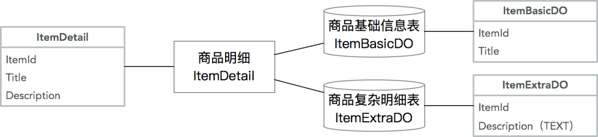
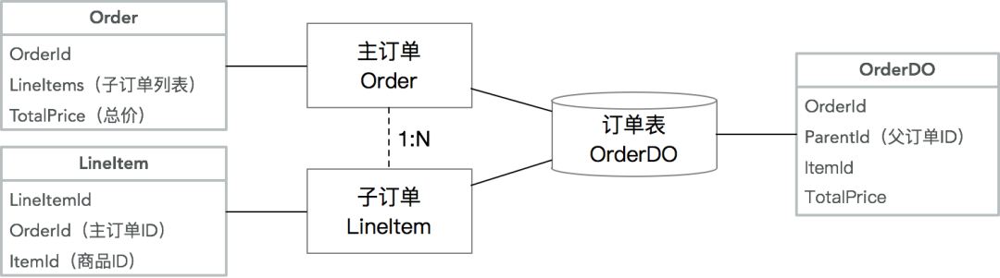
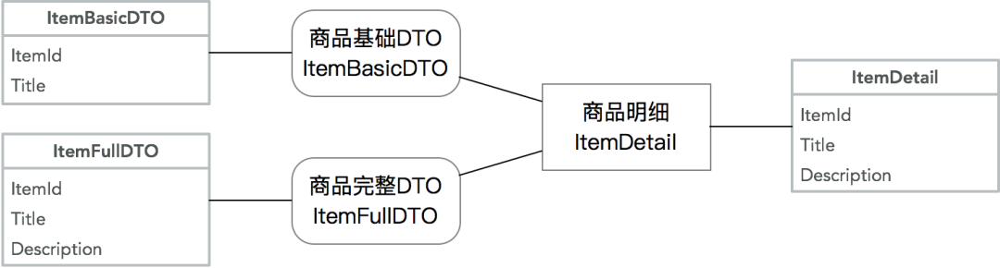
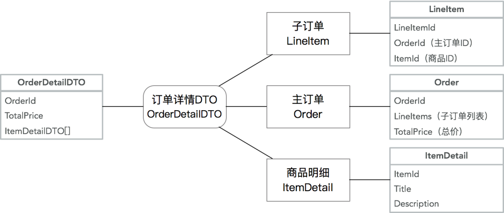
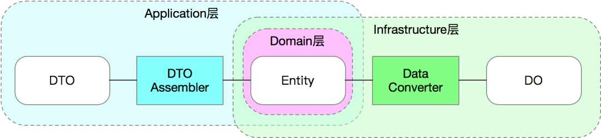
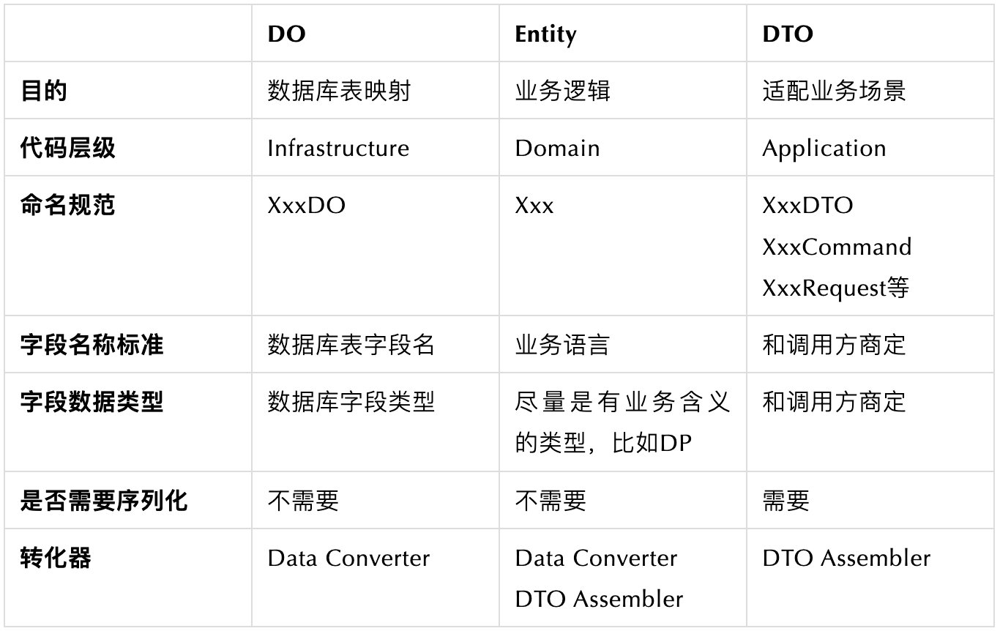

详解DDD系列 第三讲 - Repository模式
======
> 殷浩，大淘宝技术，2020-05-15 16:20
>
> [原文](https://mp.weixin.qq.com/s/1bcymUcjCkOdvVygunShmw)
>
> 请认真细心阅读，实践一遍代码，才会有深刻思考和大收获。


# 写在前面：
这篇文章和《详解DDD系列 第二弹 - 应用架构》隔了比较久，一方面是工作比较忙，
另一方面是**在讲Repository之前其实应该先讲Entity（实体）、Aggregate Root（聚合根）、Bounded Context（限界上下文）等概念**。
但在实际写的过程中，发现单纯讲Entity相关的东西会比较抽象，很难落地。
所以本文被推倒重来，**从Repository开始入手，先把可以落地的、能形成规范的东西先确定下来，最后再尝试落地Entity**。
这个当然也是我们可以**在日常按照DDD重构时尝试的路径**。

提前预告，接下来的一篇文章将**覆盖Anti-Corruption Layer（防腐层）的逻辑**，但是你会发现跟**Repository模式的理念**非常接近。
等所有周边的东西都覆盖之后，再**详细讲Entity**也许会变得不那么抽象。

**DDD 的宏观理念**其实并不难懂，但是如同 REST 一样，**DDD 也只是一个设计思想，缺少一套完整的规范，导致DDD新手落地困难**。

我之前的**架构篇主要从顶层设计往下看(自顶向下)**，从这一篇开始我希望能**填补上一些 DDD 的代码落地规范，帮助同学在日常工作中落地 DDD 思想**，
并且希望能**通过一整套规范，让不同的业务之间的同学能够更快的看懂、掌握对方的代码**。
但是规则是死的、人是活的，各位同学需要**根据自己业务的实际情况去有选择的去落地规范，DDD 的规范**不可能覆盖所有场景，
但我希望能通过解释，让同学们**了解 DDD 背后的一些思考和取舍**。

# 为什么要用 Repository

## 实体模型 vs. 贫血模型
**Entity（实体）**这个词在计算机领域的最初应用可能是来自于Peter Chen在1976年的“The Entity-Relationship Model - Toward a Unified View of Data"（ER模型），
用来**描述实体之间的关系**，而**ER模型**后来逐渐的演变成为一个**数据模型**，在关系型数据库中代表了**数据的储存方式**。

而2006年的JPA标准，通过@Entity等注解，以及Hibernate等ORM框架的实现，
让很多Java开发**对Entity的理解停留在了数据映射层面，忽略了Entity实体的本身行为**，
造成今天很多的模型仅包含了**实体的数据和属性**，而**所有的业务逻辑**都被分散在多个服务、Controller、Utils工具类中，
这个就是Martin Fowler所说的的**Anemic Domain Model（贫血领域模型）**。

**如何知道你的模型是贫血的**呢？可以看一下你代码中是否有以下的几个特征：
1. **有大量的XxxDO对象**：这里DO虽然有时候代表了Domain Object，但实际上仅仅是**数据库表结构的映射**，里面没有包含（或包含了很少的）**业务逻辑**；
2. **服务和Controller里有大量的业务逻辑**：比如**校验逻辑、计算逻辑、格式转化逻辑、对象关系逻辑、数据存储逻辑**等；
3. 大量的Utils工具类等。

而**贫血模型的缺陷**是非常明显的：
1. **无法保护模型对象的完整性和一致性**：因为对象的所有属性都是公开的，只能由调用方来维护**模型的一致性**，而这个是没有保障的；
   之前曾经出现的案例就是调用方没有能维护**模型数据的一致性**，导致**脏数据**使用时出现bug，这一类的bug还特别隐蔽，很难排查到。
2. **对象操作的可发现性极差**：单纯从对象的属性上很难看出来**都有哪些业务逻辑，什么时候可以被调用，以及可以赋值的边界是什么**；
   比如说，Long类型的值是否可以是0或者负数？
3. **代码逻辑重复**：比如**校验逻辑、计算逻辑**，都很容易**出现在多个服务、多个代码块里，提升维护成本和bug出现的概率**；
   一类常见的bug就是当**贫血模型变更**后，**校验逻辑**由于出现在多个地方，没有能跟着变，导致**校验失败或失效**。
4. **代码的健壮性差**：比如一个数据模型的变化可能导致从上到下的所有代码的变更。
5. **强依赖底层实现**：**业务代码**里强依赖了底层数据库、网络/中间件协议、第三方服务等，造成核心逻辑代码的僵化且维护成本高。

虽然贫血模型有很大的缺陷，但是在我们日常的代码中，我见过的99%的代码都是**基于贫血模型，为什么**呢？
我总结了以下几点：
1. **数据库思维**：从有了数据库的那一天起，开发人员的**思考方式**就逐渐**从“写业务逻辑“转变为了”写数据库逻辑”**，也就是我们经常说的在写CRUD代码。
2. **贫血模型“简单”**：贫血模型的优势在于“简单”，仅仅是对数据库表的字段映射，所以可以从前到后用统一格式串通。
   这里简单打了引号，是因为它只是表面上的简单，实际上当未来有**模型变更**时，你会发现其实并不简单，每次变更都是非常复杂的事情。
3. **脚本思维**：很多常见的代码都属于“脚本”或“胶水代码”，也就是**流程式代码**。
   脚本代码的好处就是比较容易理解，但长久来看缺乏健壮性，维护成本会越来越高。

但是可能**最核心的原因**在于，实际上我们在日常开发中，混淆了两个概念：
* **数据模型（Data Model）**：指**业务数据该如何持久化，以及数据之间的关系**，也就是传统的ER模型；
* **业务模型/领域模型（Domain Model）**：指**业务逻辑中，相关联的数据该如何联动**。

所以，**解决这个问题的根本方案，就是要在代码里严格区分Data Model和Domain Model，具体的规范**会在后文详细描述。
在真实代码结构中，Data Model和 Domain Model实际上会分别在不同的层里，
**Data Model只存在于数据层，而Domain Model在领域层，而链接了这两层的关键对象，就是Repository**。


## Repository的价值
在传统的数据库驱动开发中，我们会**对数据库操作做一个封装**，一般叫做**Data Access Object（DAO）**。
**DAO的核心价值是封装了拼接SQL、维护数据库连接、事务等琐碎的底层逻辑，让业务开发可以专注于写代码**。
但是在本质上，DAO的操作还是数据库操作，DAO的某个方法还是在直接操作数据库和数据模型，只是少写了部分代码。
在Uncle Bob的《代码整洁之道》一书里，作者用了一个非常形象的描述：
* **硬件（Hardware）**：指创造了之后**不可（或者很难）变更的东西**。数据库对于开发来说，就属于”硬件“，数据库选型后基本上后面不会再变，
  比如：用了MySQL就很难再改为MongoDB，改造成本过高。
* **软件（Software）**：指创造了之后**可以随时修改的东西**。对于开发来说，**业务代码**应该追求做”软件“，因为**业务流程、规则在不停的变化**，我们的代码也应该能随时变化。
* **固件（Firmware）**：即那些**强烈依赖了硬件的软件**。我们常见的是路由器里的固件或安卓的固件等等。
  **固件的特点是对硬件做了抽象，但仅能适配某款硬件，不能通用**。所以今天不存在所谓的通用安卓固件，而是每个手机都需要有自己的固件。

从上面的描述我们能看出来，**数据库在本质上属于”硬件“，DAO 在本质上属于”固件“，而我们自己的代码希望是属于”软件“**。
但是，**固件**有个非常不好的特性，那就是**会传播**，也就是说**当一个软件强依赖了固件时，由于固件的限制，会导致软件也变得难以变更，最终让软件变得跟固件一样难以变更**。

举个软件很容易被“固化”的例子：
```
private OrderDAO orderDAO;

public Long addOrder(RequestDTO request) {
    // 此处省略很多拼装逻辑
    OrderDO orderDO = new OrderDO();
    orderDAO.insertOrder(orderDO);
    return orderDO.getId();
}

public void updateOrder(OrderDO orderDO, RequestDTO updateRequest) {
    orderDO.setXXX(XXX); // 省略很多
    orderDAO.updateOrder(orderDO);
}

public void doSomeBusiness(Long id) {
    OrderDO orderDO = orderDAO.getOrderById(id);
    // 此处省略很多业务逻辑
}
```
在上面的这段简单代码里，该对象依赖了DAO，也就是依赖了DB。
虽然乍一看感觉并没什么毛病，但是假设未来要加一个缓存逻辑，代码则需要改为如下：
```
private OrderDAO orderDAO;
private Cache cache;

public Long addOrder(RequestDTO request) {
    // 此处省略很多拼装逻辑
    OrderDO orderDO = new OrderDO();
    orderDAO.insertOrder(orderDO);
    cache.put(orderDO.getId(), orderDO);
    return orderDO.getId();
}

public void updateOrder(OrderDO orderDO, RequestDTO updateRequest) {
    orderDO.setXXX(XXX); // 省略很多
    orderDAO.updateOrder(orderDO);
    cache.put(orderDO.getId(), orderDO);
}

public void doSomeBusiness(Long id) {
    OrderDO orderDO = cache.get(id);
    if (orderDO == null) {
        orderDO = orderDAO.getOrderById(id);
    }
    // 此处省略很多业务逻辑
}
```
这时，你会发现因为插入的逻辑变化了，导致在所有的使用**数据**的地方，都需要从1行代码改为至少3行。
而当你的代码量变得比较大，然后如果在某个地方你忘记了查缓存，或者在某个地方忘记了更新缓存，轻则需要查数据库，重则是缓存和数据库不一致，导致bug。
当你的代码量变得越来越多，直接调用DAO、缓存的地方越来越多时，每次底层变更都会变得越来越难，越来越容易导致bug。
这就是**软件被“固化”的后果**。

所以，我们需要一个模式，能够**隔离我们的软件（业务逻辑）和固件/硬件（DAO、DB），让我们的软件变得更加健壮**，而这个就是**Repository的核心价值**。


# 模型对象代码规范

## 对象类型
在讲Repository规范之前，我们需要先讲清楚**3种模型的区别，Entity、Data Object (DO)和Data Transfer Object (DTO)**：

* **Data Object（DO、数据对象）**：实际上是我们在日常工作中最常见的**数据模型**。
  但是**在DDD的规范里，DO应该仅仅作为数据库物理表格的映射，不能参与到业务逻辑中**。
  为了简单明了，DO的字段类型和名称应该和数据库物理表格的字段类型和名称一一对应，这样我们不需要去跑到数据库上去查一个字段的类型和名称。
  （当然，实际上也没必要一摸一样，只要你在Mapper那一层做到字段映射）
* **Entity（实体对象）**：实体对象是我们正常业务应该用的**业务模型，它的字段和方法应该和业务语言保持一致**，和持久化方式无关。
  也就是说，Entity和DO很可能有着完全不一样的字段命名和字段类型，甚至嵌套关系。
  **Entity的生命周期应该仅存在于内存中**，不需要可序列化和可持久化。
* **DTO（传输对象）**：主要作为Application层的入参和出参，比如CQRS里的Command、Query、Event，以及Request、Response等都属于DTO的范畴。
  **DTO的价值在于适配不同的业务场景的入参和出参**，避免让业务对象变成一个万能大对象。


## 模型对象之间的关系
在实际开发中DO、Entity和DTO不一定是1:1:1的关系。一些常见的非1:1关系如下：

**复杂的Entity拆分多张数据库表**：常见的原因在于**字段过多，导致查询性能降低**，需要将非检索、大字段等单独存为一张表，提升基础信息表的检索效率。
常见的案例如**商品模型**，将商品详细描述等大字段单独保存，提升查询性能：



**多个关联的Entity合并一张数据库表**：这种情况通常出现在拥有**复杂的Aggregate Root - Entity关系**的情况下，且需要**分库分表**，
为了避免多次查询和分库分表带来的不一致性，牺牲了单表的简洁性，提升查询和插入性能。常见的案例如**主子订单模型**：



**从复杂Entity里抽取部分信息形成多个DTO**：这种情况通常在**Entity复杂**，但是**调用方只需要部分核心信息**的情况下，通过一个小的DTO降低信息传输成本。
同样拿**商品模型**举例，基础DTO可能出现在商品列表里，这个时候不需要复杂详情：



**合并多个Entity为一个DTO**：这种情况通常为了**降低网络传输成本，降低服务端请求次数**，将多个Entity、DP等对象合并序列化，并且让DTO可以嵌套其他DTO。
同样常见的案例是在**订单详情**里需要展示商品信息：




## 模型所在模块和转化器
由于现在从一个对象变为3+个对象，对象间需要通过转化器（Converter/Mapper）来互相转化。
而这三种对象在代码中所在的位置也不一样，简单总结如下：



**DTO Assembler**：**在Application层，Entity到DTO的转化器**有一个标准的名称叫DTO Assembler。
Martin Fowler在P of EAA一书里**对于DTO 和 Assembler的描述：Data Transfer Object**。
DTO Assembler的**核心作用**就是**将1个或多个相关联的Entity转化为1个或多个DTO**。

**Data Converter**：**在Infrastructure层，Entity到DO的转化器**没有一个标准名称，但是为了区分Data Mapper，我们叫这种转化器Data Converter。
这里要注意**Data Mapper**通常情况下指的是**DAO**，比如Mybatis的Mapper。Data Mapper的出处也在P of EAA一书里：Data Mapper。

如果是手写一个Assembler，通常我们会去实现2种类型的方法，如下；Data Converter的逻辑和此类似，略过。
```java
public class DtoAssembler {
    // 通过各种实体，生成DTO
    public OrderDTO toDTO(Order order, Item item) {
        OrderDTO dto = new OrderDTO();
        dto.setId(order.getId());
        dto.setItemTitle(item.getTitle()); // 从多个对象里取值，且字段名称不一样
        dto.setDetailAddress(order.getAddress.getDetail()); // 可以读取复杂嵌套字段
        // 省略N行
        return dto;
    }

    // 通过DTO，生成实体
    public Item toEntity(ItemDTO itemDTO) {
        Item entity = new Item();
        entity.setId(itemDTO.getId());
        // 省略N行
        return entity;
    }
}
```
我们能看出来通过抽象出一个Assembler/Converter对象，我们能把复杂的转化逻辑都收敛到一个对象中，并且可以很好的单元测试。
这个也很好的收敛了常见代码里的转化逻辑。

在调用方使用时是非常方便的（请忽略各种异常逻辑）：
```java
public class Application {
    private DtoAssembler assembler;
    private OrderRepository orderRepository;
    private ItemRepository itemRepository;

    public OrderDTO getOrderDetail(Long orderId) {
        Order order = orderRepository.find(orderId);
        Item item = itemRepository.find(order.getItemId());
        return assembler.toDTO(order, item); // 原来的很多复杂转化逻辑都收敛到一行代码了
    }
}
```
虽然Assembler/Converter是非常好用的对象，但是当**业务复杂**时，手写Assembler/Converter是一件耗时且容易出bug的事情，
所以业界会有多种Bean Mapping的解决方案，从本质上分为动态和静态映射。

**动态映射方案**包括比较原始的 BeanUtils.copyProperties、能通过xml配置的Dozer等，其**核心是在运行时根据反射动态赋值**。
动态方案的缺陷在于大量的反射调用，性能比较差，内存占用多，不适合特别高并发的应用场景。

所以在这里我给用Java的同学推荐一个库叫**MapStruct**（MapStruct官网）。
MapStruct**通过注解，在编译时静态生成映射代码**，其最终编译出来的代码和手写的代码在性能上完全一致，且有强大的注解等能力。
如果你的IDE支持，甚至可以在编译后看到编译出来的映射代码，用来做check。在这里我就不细讲MapStruct的用法了，具体细节请见官网。

用了MapStruct之后，会节省大量的成本，让代码变得简洁如下：
```java
@org.mapstruct.Mapper
public interface DtoAssembler { // 注意这里变成了一个接口，MapStruct会生成实现类
    DtoAssembler INSTANCE = Mappers.getMapper(DtoAssembler.class);

    // 在这里只需要指出字段不一致的情况，支持复杂嵌套
    @Mapping(target = "itemTitle", source = "item.title")
    @Mapping(target = "detailAddress", source = "order.address.detail")
    OrderDTO toDTO(Order order, Item item);

    // 如果字段没有不一致，一行注解都不需要
    Item toEntity(ItemDTO itemDTO);
}
```
在使用了MapStruct后，你只需要**标注出字段不一致的情况**，其他的情况都通过**Convention over Configuration**帮你解决了。
还有很多复杂的用法我就不一一指出了。


## 模型规范总结



从**使用复杂度**角度来看，区分了DO、Entity、DTO带来了代码量的膨胀（从1个变成了3+2+N个）。
但是在**实际复杂业务场景**下，**通过功能来区分模型带来的价值是功能性的单一和可测试、可预期**，最终反而是**逻辑复杂性的降低**。


# Repository代码规范

## 接口规范


